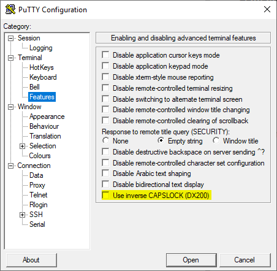
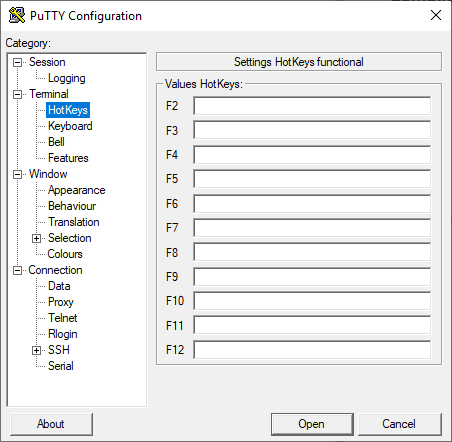
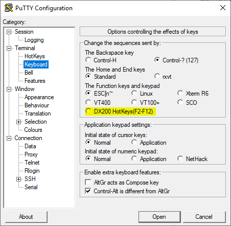

# PuTTY is a terminal client

  
 This is a fork of a original stable version 0.71 PuTTY [www.chiark.greenend.org.uk](https://www.chiark.greenend.org.uk/~sgtatham/putty/latest.html)

The main reason of this fork is to adapt this fantastic terminal client for comfortable work with telecom equipment produced by Nokia. Such as DX200 BSC, MSC/MSS, MGW, SGSN and also Nokia RNC450 and IPA2600

### Changes:
- Added the ability to activate the inverted value of CAPS LOCK. The MML terminal accepts commands sent only used capital letters.
- Functional keys F2-F12 can be used for send configutable commands to terminal (like it was in RWIN)

### Screenshots:

#### Pre-compiled binary files (VS2017 Windows10) :
- [Windows x86](https://github.com/OloloevReal/putty/tree/DX/builds/x86)
- [Windows x64](https://github.com/OloloevReal/putty/tree/DX/builds/x64)

Original [README](https://raw.githubusercontent.com/OloloevReal/putty/DX/README) and [LICENCE](https://raw.githubusercontent.com/OloloevReal/putty/DX/LICENCE)
